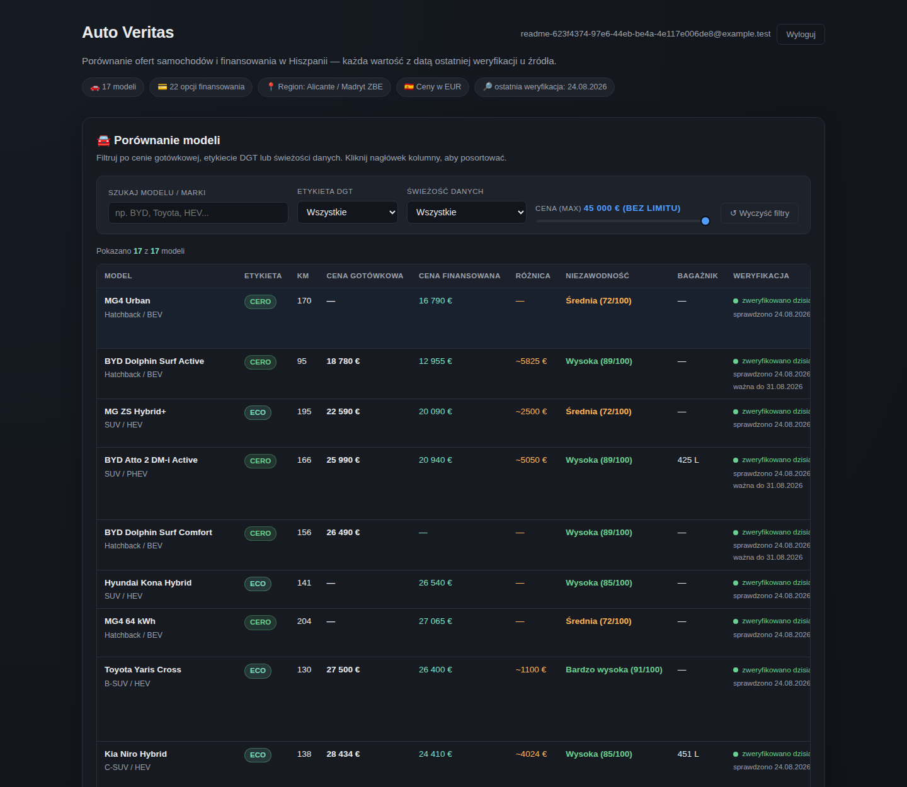
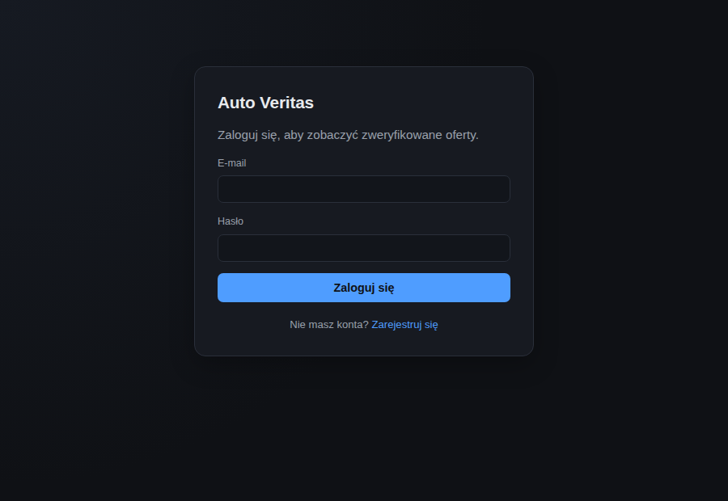

# Auto Veritas

[](https://github.com/konradcinkusz/auto-veritas/actions/workflows/ci.yml)
[](https://github.com/konradcinkusz/auto-veritas/actions/workflows/codeql.yml)
[](https://github.com/konradcinkusz/auto-veritas/actions/workflows/secret-scan.yml)
[](LICENSE)

A login-gated comparison site for car offers and financing on the Spanish
market. Viewers can only read. Every offer is entered and re-verified by the
owner's agent through the API, and every value carries its trust metadata:
**when it was last verified at source, how long the seller declares it valid,
and when the source itself was published** — with per-data-type staleness
thresholds (prices 7/30 days, credit rates 14/45 days, specs 6/12 months).
Stale data is degraded and labelled, never hidden; estimates are marked
"szacunek"; balloon financing structures are called out as **BALON** instead of
hiding behind a low monthly rate. Every price/rate change the agent makes is
kept — a "Historia" panel on each row shows what it used to be, when it
changed, and who changed it.

Built to the [architecture-standards](https://github.com/konradcinkusz/architecture-standards)
reference architecture, with [authservice](https://github.com/konradcinkusz/authservice)
(run from its published container image, `v0.3.1`) as the only identity provider.

## Screenshots

[](docs/screenshots/dashboard.png)

Every row carries its freshness badge and verification date; stale or expired
offers sink to the bottom instead of disappearing, price estimates are marked
"szacunek", and balloon financing is called out with a **BALON** chip instead
of hiding behind the monthly rate. There is no anonymous view — sign-in is
required before any offer is visible:



## Stack

| Piece | What |
|---|---|
| `src/AutoVeritas.OffersService` | .NET 10 minimal API; owns `offersdb` (PostgreSQL, committed migrations); JWT verify-only against authservice's JWKS; reads for any signed-in user, writes for the `Admin`/`SuperAdmin` role |
| `src/AutoVeritas.ServiceDefaults` | The shared kernel: OTel, health split, discovery + resilience, JWT, CORS, rate limiting, validation filter (800-line ceiling enforced in CI) |
| `src/AutoVeritas.AppHost` | .NET Aspire dev composition: postgres + authservice image + service + web |
| `apps/web` + `packages/web-kit` | Next.js 15 (standalone) behind a BFF: HttpOnly cookie sessions, `/api/proxy/[...path]` candidate ladder, JWKS-verifying edge middleware, Polish dark-theme comparison UI |
| `flyio/` + `.github/workflows/flyio.yml` | Fly.io topology (4 apps) and the tag-driven ordered deploy |
| `e2e/` | Playwright smoke tier (charter in `e2e/CHARTER.md`), run in CI against the compose stack |

## Run it locally

```bash
# once: the RS256 dev signing key for the local authservice
./scripts/generate-jwt-key.sh          # Windows: scripts/generate-jwt-key.ps1

docker compose up --build
open http://localhost:3000
```

Register any account to browse. The seeded local admin is
`admin@auto-veritas.local` / `Admin123!` (compose defaults, overridable via
`.env` — see `secrets.env.example`).

With the .NET SDK + Docker, the Aspire AppHost runs the same topology with one
command (`dotnet run --project src/AutoVeritas.AppHost`) after storing the dev
key in user-secrets (the AppHost file header shows the exact command).

Both local paths and the deploy are covered end to end, with the gotchas, in
[`docs/RUNBOOK.md`](docs/RUNBOOK.md).

## Tests

```bash
dotnet test AutoVeritas.slnx      # 52 backend tests (SQLite-backed API tests)
pnpm test && pnpm lint && pnpm build
pnpm e2e                          # needs the compose stack up
```

## How offers get in

Through the API only — the UI has no write surface. The complete agent workflow
(account setup, adding, re-verifying, what the API refuses) is in
[`docs/AGENT-GUIDE.md`](docs/AGENT-GUIDE.md).

## Deploying

`flyio/` holds the annotated per-app configs; [`flyio/SECRETS.md`](flyio/SECRETS.md)
is the one-time setup runbook (a GitHub environment with four root secrets).
After that, every `v*` tag builds changed images once and deploys in dependency
order — `.github/workflows/flyio.yml`.

## Documentation

- [`docs/RUNBOOK.md`](docs/RUNBOOK.md) — running it: compose, Aspire, and the
  Fly.io deploy, in one place
- [`docs/architecture/`](docs/architecture/) — current state, gap analysis
  against the standards, target architecture, build plan, decisions, and the
  dated deviation register
- [`docs/ux/UI-UX.md`](docs/ux/UI-UX.md) — screens, flows, ranked backlog
- [`docs/security/`](docs/security/) — the pre-exposure security review
