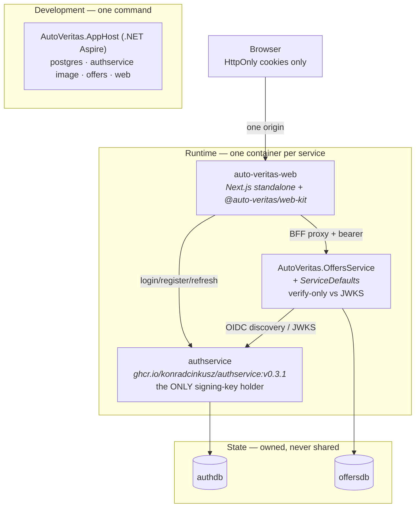

# 03 — Target architecture

Expressed in the reference architecture's vocabulary
(`architecture-standards/docs/architecture/00-REFERENCE-ARCHITECTURE.md`,
P1–P15). This is the shape the repository now implements.

## The system in one picture

## The pieces

- **Identity (P5).** authservice, consumed as a version-pinned published container
  image, is this system's only identity provider. It alone holds the RS256
  private key; the OffersService validates via `Jwt:MetadataAddress` → JWKS, and
  the web edge middleware verifies signatures with `jose` against the same JWKS.
  Platform roles come from authservice: viewers are ordinary users (no role
  claim); the owner's agent holds `Admin` (granted by the seeded SuperAdmin).
- **Product service (P2, P3, P4, P9).** `AutoVeritas.OffersService` owns
  `offersdb`, applies committed PostgreSQL migrations in a hosted service after
  Kestrel starts, seeds insert-if-missing by slug, and exposes the authorization
  triad in its `Program.cs` manifest: authenticated reads, `Admin|SuperAdmin`
  writes, no anonymous product surface.
- **The verification domain.** Every offer carries three distinct dates
  (`lastVerifiedAt`, `offerValidUntil`, `sourcePublishedAt`), a confidence flag
  (confirmed vs estimated), and — for financing — the repayment structure
  (linear / balloon / subscription). Freshness is computed server-side against
  per-data-type thresholds (prices 7/30 days, rates 14/45 days, specs 6/12
  months; a passed `offerValidUntil` overrides everything as Expired) and is
  published at `/api/v1/meta/freshness-policy` so the UI renders the thresholds
  it actually enforces. Stale data is degraded and labelled, never hidden.
- **Frontend (FRONTEND-BFF).** One Next.js app in one pnpm workspace with
  `@auto-veritas/web-kit` holding all security-relevant plumbing: HttpOnly
  cookie sessions (single set/clear definition), the `/api/auth/*` BFF routes,
  serialized refresh rotation, the `/api/proxy/[...path]` catch-all with the
  candidate ladder (env → Aspire discovery → localhost), runtime `/api/config`,
  and the JWKS-verifying edge middleware.
- **Kernel (P2).** `AutoVeritas.ServiceDefaults`: OTel, health split
  (liveness/readiness), service discovery + resilience, verify-only JWT,
  config-driven CORS, user-partitioned rate limiting, and the DataAnnotations
  endpoint filter. The 800-line ceiling and the no-domain rule are CI jobs, not
  prose.
- **Topology (P7).** Four Fly apps (`flyio/*.fly.toml`): postgres (6PN-only,
  volume, no public listener), authservice (pinned image, one machine — it is
  the JWKS issuer on every validation path), offers (scale-to-zero under the
  BFF's 120 s timeout), web. Cost reasoning lives in
  `flyio/INFRASTRUCTURE-ANALYSIS.md`.
- **Delivery (P12).** Tag-driven workflow: diff-vs-previous-tag change detection
  with the missing-app rule, build-once to `registry.fly.io`, ordered deploys
  (state → auth → domain → frontend) gated `success || skipped`, secrets staged
  from one GitHub environment, and a JWKS non-emptiness assertion after every
  authservice deploy.

## Deliberate non-goals

No service mesh, no event bus, no shared DbContext, no custom DI container, no
platform abstraction over Fly — per the constitution §4. Additions of this kind
are recorded decisions, never defaults.
